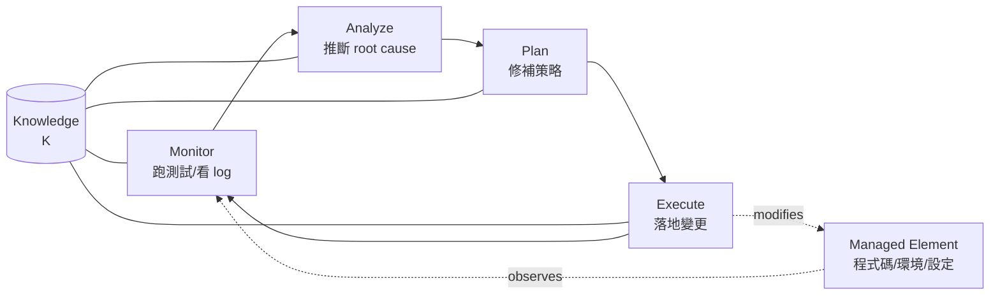
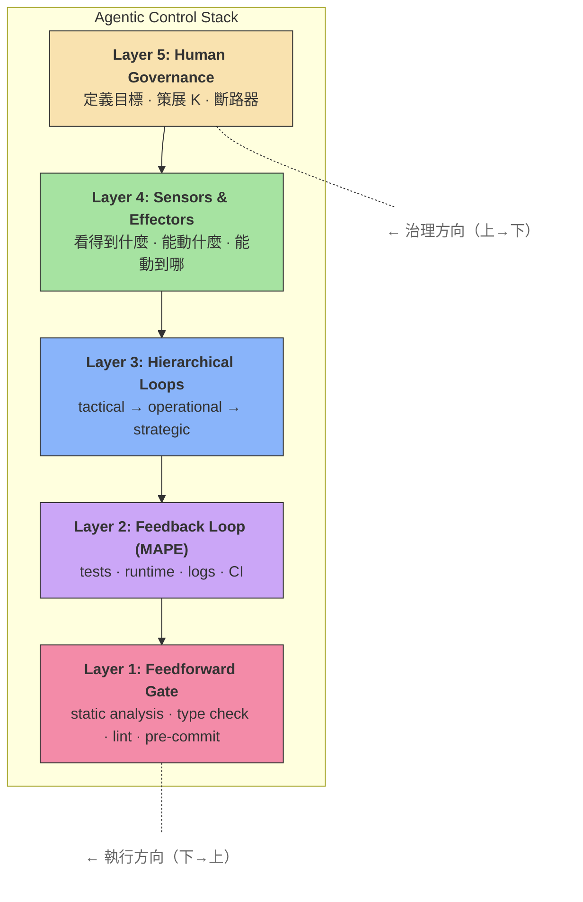
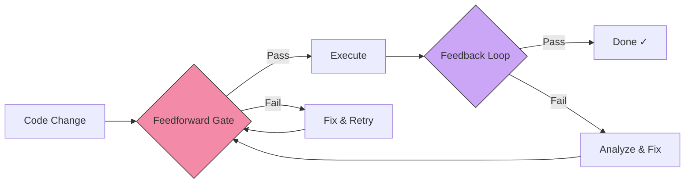
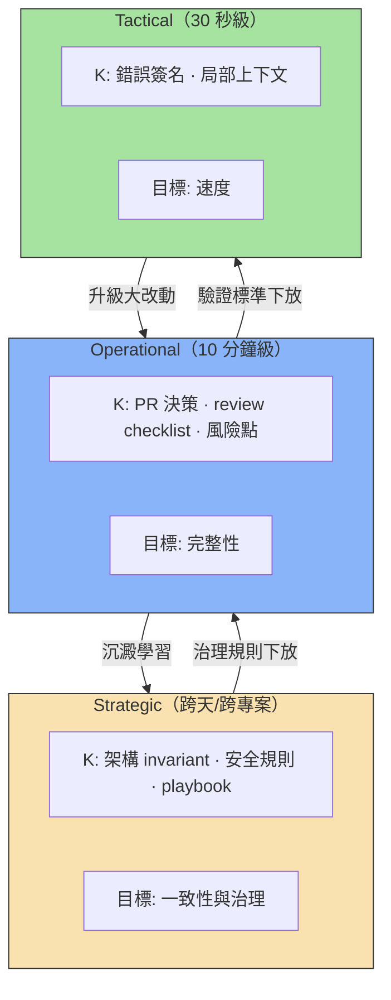
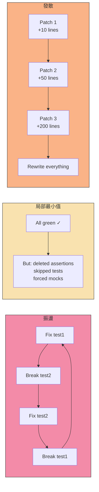
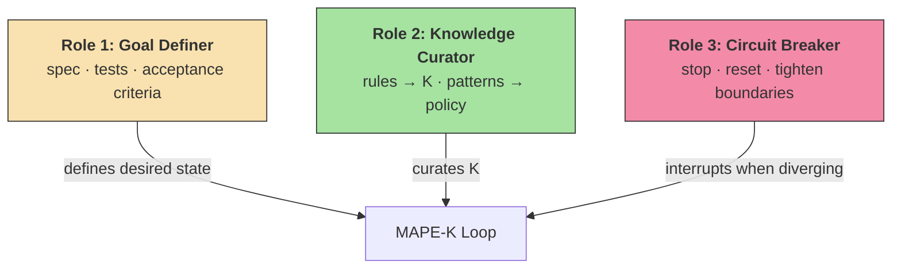
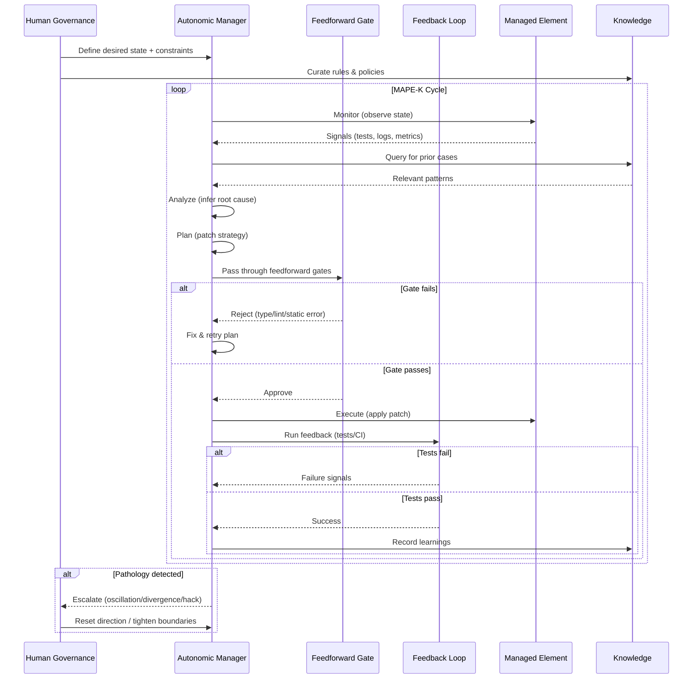

# Diagrams for Teaching

Mermaid diagrams ready to embed in lectures. Each diagram uses mermaid code blocks.

## Diagram 1: MAPE-K Loop

## Diagram 2: Five-Layer Agentic Control Stack

> 注意：上層治理下層（規則與約束向下傳遞），但管線執行順序是從底層（Feedforward）往上走。

## Diagram 3: Feedforward vs Feedback Pipeline

## Diagram 4: Hierarchical Loops

## Diagram 5: Loop Pathology

## Diagram 6: Human Governance Positions

## Diagram 7: Full System Overview (Sequence)

