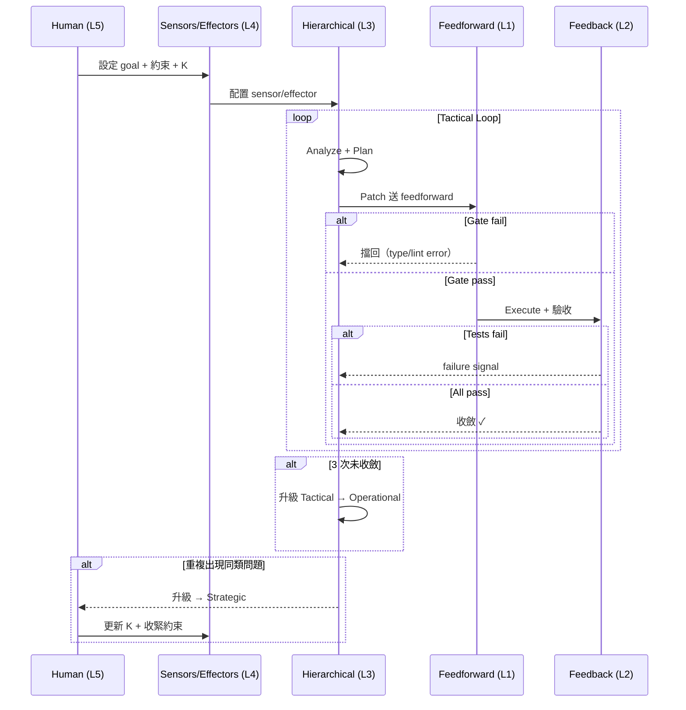

# End-to-End Walkthrough: 修復 API 500 Error

一個貫穿五層的具體案例，幫助學生把抽象框架對應到真實工作流。

## 場景

線上服務的 `/api/users/:id` endpoint 出現間歇性 500 error。你的 coding agent 被指派修復。

---

## Layer 5: Human Governance — 人先定義規則

在 agent 動手之前，人類開發者先設定：

| 人的角色 | 具體動作 |
|---|---|
| **Goal Definer** | 定義 acceptance criteria：「500 error rate 從 2% 降到 < 0.1%，且不引入新的 regression」 |
| **Knowledge Curator** | 把已知的 context 餵進 K：「這個 endpoint 用了 ORM eager loading，上次也是 null reference 造成 500」 |
| **Circuit Breaker** | 設定邊界：「只能改 `src/api/users/` 下的檔案，不能動 database schema」 |

---

## Layer 4: Sensors & Effectors — 配好手眼

Agent 啟動前，確認手眼配置：

**Sensors（能看到什麼）**:
- structured test output：哪個 test case、哪個 assertion、哪個 fixture
- production error log：structured JSON，含 request ID、user ID、stack trace
- coverage report：修改前 85%，不得低於此值

**Effectors（能動什麼）**:
- file allowlist：`src/api/users/*.ts`, `test/api/users/*.test.ts`
- diff budget：單次 patch ≤ 50 行
- tool allowlist：可用 format、可跑 test，不可用 codemod

---

## Layer 3: Hierarchical Loops — 分層處理

### Tactical（30 秒級）

Agent 第一輪嘗試：

```
Hypothesis: user.profile 可能是 null → 加 null check
Patch: if (!user.profile) return res.status(404)
Verify: 跑 test_get_user_profile → PASS
         跑 test_get_user_admin → FAIL（新 regression）
```

Tactical 層快速迭代，不需要升級。

### Operational（10 分鐘級）

Tactical 連續 3 次未完全收斂（修好一個壞另一個）→ 升級到 operational：

```
Agent 重新 Analyze：不只看單一函式，看整個 handler chain
發現：問題不在 null check，而是 middleware 的 error handling 不一致
Plan：統一 error handler pattern（影響 3 個檔案）
Verify：full test suite + lint + type check
```

### Strategic（跨天）

如果這是第三次在同一個模組出類似問題 → 升級到 strategic：

```
人介入：這個模組需要加 integration test coverage policy
K 更新：「所有 API handler 必須有 null safety 的 integration test」
```

---

## Layer 1: Feedforward Gate — 在 Execute 前擋掉低級錯

Agent 的 Plan 產出 patch 後，先過 feedforward gates：

```
1. TypeScript 型別檢查 → PASS
2. ESLint rules → WARN: unused import（自動修復）
3. Schema validation → PASS
4. Pre-commit hook（format check）→ PASS

→ 全部通過，允許 Execute
```

如果 feedforward 就擋掉了（例如型別錯誤），agent 不需要跑測試就知道要修，省掉一整輪 feedback。

---

## Layer 2: Feedback Loop (MAPE) — Execute 之後驗收

Patch 進入 feedback loop：

| MAPE 步驟 | 行為 | 結果 |
|---|---|---|
| **Monitor** | 跑 full test suite (32 tests) | 31 pass, 1 fail |
| **Analyze** | 失敗的是 `test_concurrent_requests`，stack trace 指向 race condition | Root cause: 新的 null check 和 concurrent access 衝突 |
| **Plan** | 改用 optional chaining + 加一個 lock；同時補一個 concurrent test case | 估計 +15 行改動 |
| **Execute** | Apply patch → 回到 Monitor | 32/32 pass + coverage 86% (> 85%) |

**收斂確認**：所有 oracle 達標 → loop 終止。

---

## 完整流程圖



---

## 教學用法

上課時可以這樣使用這個案例：
1. **先展示場景**，讓學生猜「你會怎麼讓 agent 修這個 bug」
2. **從 Layer 5 開始往下走**，每層問學生：「如果少了這一層，會發生什麼事？」
3. **走到 pathology**：讓學生指出如果沒有 diff budget（oscillation）、沒有 coverage check（local minimum）、沒有 file allowlist（divergence），這個案例會怎麼壞
