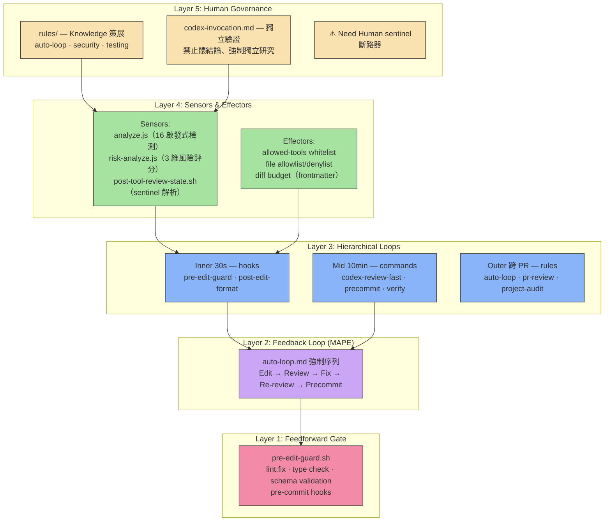
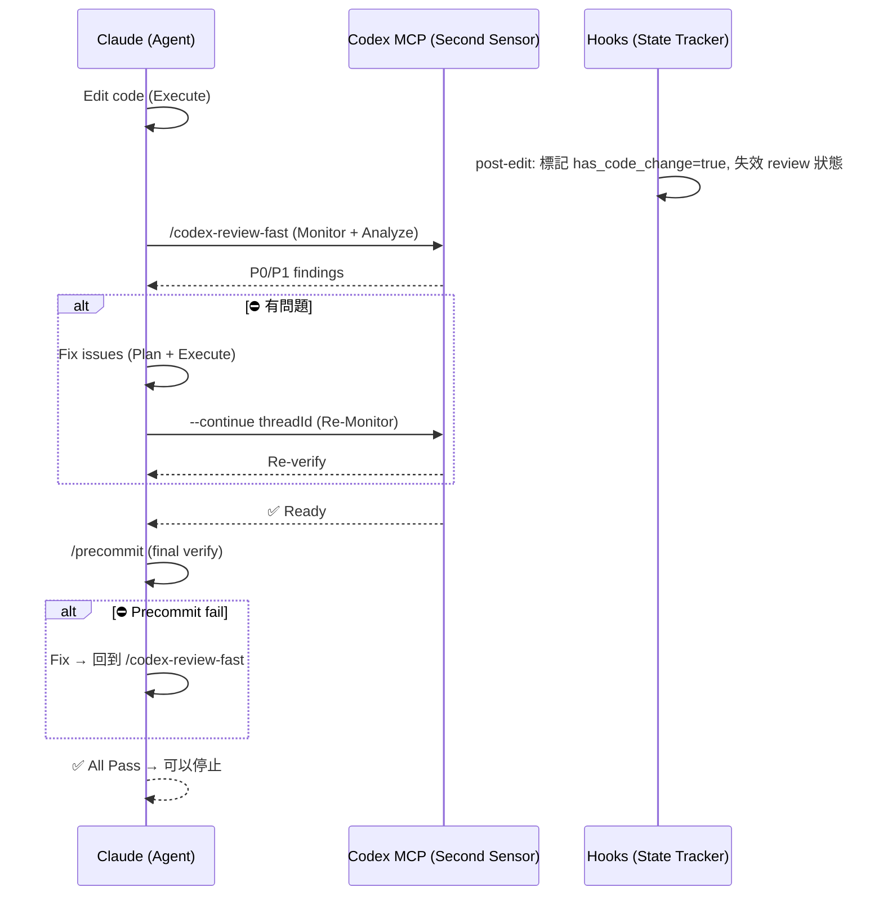
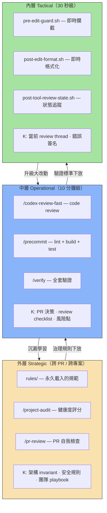
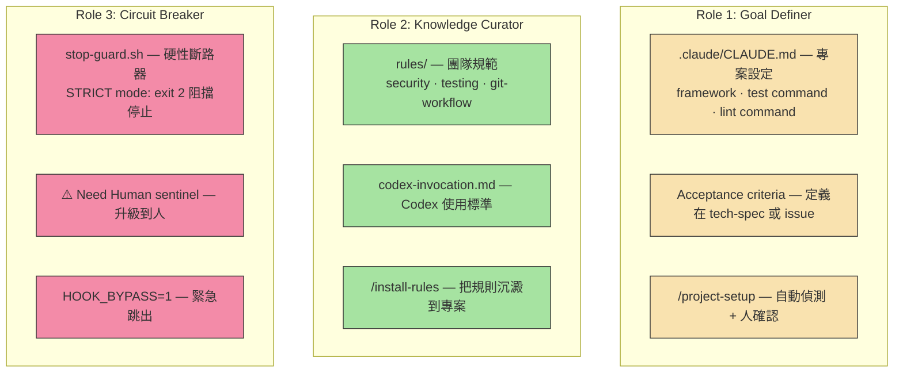
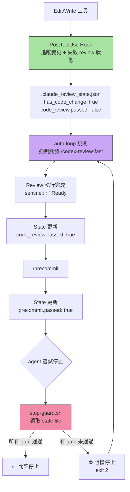
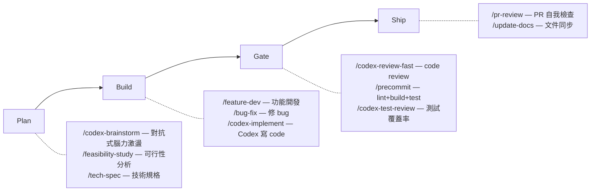

# Agentic Control Stack in Practice — 原理到實作的完整對照

> 理論告訴你「為什麼需要這些層」，實作告訴你「具體怎麼做到」。本文以 sd0x-dev-flow plugin 為範例，逐層拆解控制理論如何落地成可運行的 agentic coding system。

---

## 閱讀前提

- 原理篇：[Agentic Control Stack 講義](agentic-control-stack-lecture.md)
- 實作篇：[sd0x-dev-flow README](https://github.com/sd0xdev/sd0x-dev-flow)

---

## 全貌：五層架構的實作映射



---

## 第一層：Feedforward Gate — 在還沒跑壞之前就擋

### 原理回顧

> 把能前移的錯誤全部前移；讓 feedback loop 只處理「跑起來才知道」的問題。

### sd0x-dev-flow 的實作

Feedforward gate 在 sd0x-dev-flow 中由 **hook** 和 **precommit 前半段** 組成——都在 agent 真正執行變更「之前」或「當下」就攔截。

#### 1. `pre-edit-guard.sh` — Edit/Write 工具的守門員

每次 Claude 嘗試使用 Edit 或 Write 工具時，這個 hook 會在檔案被修改**之前**檢查：

```bash
# 阻擋敏感路徑
if echo "$file_path" | grep -Eq '(\.env|\.git/)'; then
  echo "[Edit Guard] Blocked sensitive file: $file_path" >&2
  exit 2  # 拒絕工具呼叫，檔案不會被修改
fi

# 阻擋 shell metacharacter 注入
if [[ "$file_path" =~ [\;\&\|\`] ]] || [[ "$file_path" =~ \$\( ]]; then
  echo "[Edit Guard] Rejected suspicious path" >&2
  exit 2
fi
```

**對應原理**：這就是 feedforward——不需要跑測試、不需要 runtime，純粹靠 pattern matching 就能擋掉「一定錯」的操作。

#### 2. `post-edit-format.sh` — 自動格式化（寫入即校正）

每次 Edit/Write 完成後，立即執行 prettier 自動格式化：

```bash
# 自動格式化，消除 90% 的格式類 CI failure
npx prettier --write "$file_path" 2>/dev/null
```

**對應原理**：格式化問題是典型的「確定性錯誤」——不需要 feedback loop 就知道答案。把它放在 feedforward 層，agent 永遠不會因為忘加分號而浪費一整輪 feedback。

#### 3. `/precommit` 前半段 — lint:fix + type check

```
1. lint:fix（自動修復）
2. type check（靜態型別檢查）
3. ↑ 以上兩項是 feedforward
4. test:unit ← 這才進入 feedback
```

### 效果量化

| 指標 | 說明 |
|------|------|
| Feedforward reject rate 目標 | ≥ 60%（格式 + 型別 + 敏感路徑攔截） |
| 節省的 feedback 輪數 | 每個被 feedforward 擋掉的錯誤 = 省掉 1 輪 feedback（~2 min） |

> **Punchline**：`pre-edit-guard.sh` 讓 agent 連碰都碰不到敏感檔案，`post-edit-format.sh` 讓格式問題在發生的瞬間就被修好。feedforward 做得越徹底，agent 看起來越像「天生就不會犯低級錯誤」。

---

## 第二層：Feedback Loop (MAPE) — auto-loop 強制序列

### 原理回顧

> Feedback loop 的品質不取決於「能不能修好」，而是「每一輪能把不確定性降低多少」。

### sd0x-dev-flow 的實作

Feedback loop 的核心是 `auto-loop.md` 規則——它定義了一個不可逃脫的 MAPE 循環：



#### MAPE 對應表

| MAPE 步驟 | sd0x-dev-flow 實作 | 觸發方式 |
|-----------|-------------------|---------|
| **Monitor** | `/codex-review-fast`（Codex 獨立研究 git diff） | auto-loop 規則自動觸發（code 變更後強制執行） |
| **Analyze** | Codex 獨立推斷 root cause（禁止餵結論） | Codex sandbox: read-only |
| **Plan** | Claude 根據 review findings 決定修法 | P0/P1 findings → fix strategy |
| **Execute** | Edit/Write 工具落地變更 | 變更後立即回到 Monitor |
| **Knowledge (K)** | `rules/`（團隊規範）、`--continue threadId`（保留 review 上下文）、review state JSON | 跨輪次記憶 |

注意：`/verify`（完整測試套件）和 `analyze.js`（`/next-step` 的啟發式顧問）不在 auto-loop 的強制路徑中。auto-loop 只強制 `/codex-review-fast` → `/precommit`（code）或 `/codex-review-doc`（doc）。`/verify` 和 `/next-step` 是開發者可選擇使用的輔助工具。

#### 禁止行為——防止「假收斂」

`auto-loop.md` 明確列出禁止模式，防止 agent 在未真正驗證的情況下宣稱完成：

| 禁止模式 | 為什麼危險 | 對應的控制理論問題 |
|---------|-----------|-----------------|
| 「聲明 ≠ 執行」：說「需要跑 review」但沒有實際呼叫工具 | Monitor 步驟被跳過，迴路斷裂 | Feedback loop 中斷 |
| 「摘要 ≠ 完成」：輸出漂亮的摘要就停止 | 沒有等 Monitor 回報，不知道是否真的改對 | 沒有 oracle 驗證 |
| 修完後問「要不要 re-review？」 | 等待人指令 = 迴路暫停，應自動繼續 | 不必要的 human-in-the-loop |

#### 退出條件——唯一合法的終止

```
✅ All Pass — review + precommit 全過 → 迴路收斂
⛔ Need Human — 架構級變更、人工要求停止 → 斷路器啟動
🔄 3 rounds on same issue — 報告 blocker → 升級處理
```

> **Punchline**：auto-loop 把 MAPE 從「建議」變成「強制」——agent 不能「宣稱」它做完了，它必須「證明」它做完了。

---

## 第三層：Hierarchical Loops — 三層管線各司其職

### 原理回顧

> 內層追速度，中層追完整性，外層追一致性與治理。

### sd0x-dev-flow 的實作



#### 分層詳解

| 層級 | 週期 | 實作元件 | 觸發條件 | K 的來源 |
|------|------|---------|---------|---------|
| **Inner (Tactical)** | 30 秒 | hooks（`pre-edit-guard`、`post-edit-format`、`post-tool-review-state`） | 每次 Edit/Write/Bash 工具呼叫 | `.claude_review_state.json`、當前 review thread context |
| **Mid (Operational)** | 10 分鐘 | commands（`/codex-review-fast`、`/precommit`——auto-loop 強制；`/verify` 為可選的完整驗證） | auto-loop 強制觸發 `/codex-review-fast` + `/precommit`；`/verify` 為手動觸發 | review findings、precommit 結果、`--continue threadId` |
| **Outer (Strategic)** | 跨 PR | rules（`auto-loop`、`security`、`testing`）+ commands（`/project-audit`、`/pr-review`） | 每次 session 自動載入（rules）；手動觸發（commands） | `rules/` 目錄中的團隊規範、`.claude/CLAUDE.md` |

#### 升級機制

| 升級路徑 | 觸發條件 | sd0x-dev-flow 實作 |
|---------|---------|-------------------|
| Inner → Mid | 檔案被修改 → review 狀態失效 | `post-edit-format.sh` 設 `code_review.passed = false` → auto-loop 觸發 `/codex-review-fast` |
| Mid → Outer | 同一 issue 3 rounds 未收斂 | auto-loop：`🔄 3 rounds on same issue → report blocker, request human` |
| Mid → Outer | 風險評分 High/Critical | `/risk-assess`：`score ≥ 50 → REVIEW gate`；`score ≥ 75 → BLOCK gate` |

> **Punchline**：hooks 在毫秒級攔截，commands 在分鐘級驗證，rules 在跨 PR 級治理——三層各有不同的速度和粒度，合在一起才是完整的防禦。

---

## 第四層：Sensors & Effectors — 手眼系統的具體配置

### 原理回顧

> 模型是大腦，但 sensor 和 effector 是眼和手；沒有好的手眼，大腦再強也是在黑箱裡亂摸。

### sd0x-dev-flow 的 Sensors

| Sensor | 實作檔案 | 輸出格式 | 降低什麼不確定性 |
|--------|---------|---------|----------------|
| **analyze.js** | `skills/next-step/scripts/analyze.js` | 結構化 JSON：phase、findings（P0/P1/P2）、next_actions（含 confidence） | 「現在該做什麼」的不確定性 |
| **risk-analyze.js** | `skills/risk-assess/scripts/risk-analyze.js` | 3 維評分（breaking_surface 45% + blast_radius 35% + change_scope 20%）→ Low/Medium/High/Critical | 「這次改動有多危險」的不確定性 |
| **post-tool-review-state.sh** | `hooks/post-tool-review-state.sh` | `.claude_review_state.json`：has_code_change、code_review.passed、precommit.passed | 「哪些步驟還沒做」的不確定性 |
| **Codex MCP（獨立研究）** | `mcp__codex__codex` + `codex-invocation.md` 規則 | 五維度 review report + P0/P1/P2 findings + Gate sentinel | 「程式碼品質是否達標」的不確定性 |

#### Sensor 品質的關鍵：結構化 > Raw text

`analyze.js` 的設計展示了好 sensor 的特徵——它不是丟一堆 raw text 給模型看，而是輸出結構化 JSON：

```json
{
  "phase": "mid_development",
  "next_actions": [
    {
      "id": "gate-missing-code-review",
      "command": "/codex-review-fast",
      "reason": "Code changed but review not executed",
      "confidence": 1.0
    }
  ],
  "findings": [
    { "id": "security-hotspot", "priority": "P1", "message": "Modified auth-related file" }
  ]
}
```

這比 `"你有一些檔案改了，可能需要 review"` 有用一百倍。

### sd0x-dev-flow 的 Effectors

| Effector | 實作方式 | 控制什麼 |
|----------|---------|---------|
| **allowed-tools whitelist** | 每個 skill SKILL.md 的 `allowed-tools` frontmatter | agent 在執行該 skill 時能用哪些工具 |
| **file denylist** | `pre-edit-guard.sh` + `GUARD_EXTRA_PATTERNS` 環境變數 | 哪些檔案不能被修改 |
| **Codex sandbox** | `sandbox: 'read-only'` + `approval-policy: 'never'` | Codex 只能讀不能寫，不能執行破壞性命令 |
| **diff budget** | skill 設計中的單次 patch 上限 | 單次改動不能超過一定行數 |
| **tool allowlist** | `/precommit` 只能跑 lint/build/test，不能跑 codemod | 限制執行階段可用的工具類型 |

#### 安全控制表：手眼系統的防護面

| 威脅 | 偵測 Sensor | 控制 Effector | 斷路條件 |
|------|-----------|-------------|---------|
| Secret 洩漏 | `pre-edit-guard.sh`：預設阻擋 `.env` 和 `.git/`（credentials 等需透過 `GUARD_EXTRA_PATTERNS` 額外配置） | file denylist → exit 2 拒絕修改 | 偵測到匹配 pattern → 工具呼叫被拒絕 |
| Unsafe tool 呼叫 | `allowed-tools` whitelist 比對（SKILL.md frontmatter） | 未列在 whitelist 的工具無法使用 | 嘗試使用未授權工具 → 阻擋 |
| Shell 注入 | `pre-edit-guard.sh`：shell metacharacter regex 檢測（`;` `&` `\|` `` ` `` `$()`） | 路徑驗證 → exit 2 拒絕 | 偵測到可疑路徑 → 工具呼叫被拒絕 |
| 敏感路徑越界 | `pre-edit-guard.sh`：內建 denylist + `GUARD_EXTRA_PATTERNS` 環境變數 | 匹配的路徑直接被阻擋（exit 2） | 嘗試編輯 `.git/`、`.env` 或自訂 pattern → 拒絕 |

**目前未實作的安全控制**（可作為未來增強方向）：
- 依賴竄改偵測（lockfile hash gate）——目前 lockfile 僅用於偵測 package manager，未有唯讀阻擋
- 改動範圍追蹤（path-scope enforcement）——`post-tool-review-state.sh` 僅做 sentinel 解析與狀態更新，未做改動範圍限制

> **Punchline**：sd0x-dev-flow 的 sensor 分為兩類——確定性腳本（`analyze.js`、`risk-analyze.js`）輸出結構化 JSON，review 類工具（Codex）輸出 Markdown + sentinel 字串再由 hook regex 解析。兩者都比 raw text 好，但結構化程度不同，設計時要意識到 sentinel 解析的邊界條件。effector 全部有明確的 allowlist——這就是「好的手眼」的具體實現。

---

## 第五層：Human Governance — 人的三個角色如何落地

### 原理回顧

> 開發者的角色正在從「寫 code 的人」變成「設計與調校控制迴路的人」。

### sd0x-dev-flow 中人的三個角色



#### Role 1: Goal Definer — 定義「什麼叫對」

| 實作 | 做什麼 | 為什麼重要 |
|------|--------|-----------|
| `.claude/CLAUDE.md` | 定義 framework、test command、lint command、build command | 沒有這些，agent 連 `/precommit` 都不知道跑什麼 |
| `/project-setup` | 自動偵測專案環境 + 填寫 placeholder | 降低人手動設定的成本 |
| tech-spec / issue | 定義 acceptance criteria | 這是 oracle 的基礎——如果「什麼叫對」沒定義好，loop 必定收斂到錯的地方 |

#### Role 2: Knowledge Curator — 策展 K

| 實作 | 做什麼 | 對應原理 |
|------|--------|---------|
| `rules/` 目錄（10 條規則） | 定義 auto-loop、security checklist、testing convention | 這就是 K——不是 agent 每次自己發現，而是人把規則沉澱下來 |
| `codex-invocation.md` | 定義 Codex 呼叫標準（禁止餵結論、強制獨立研究） | 確保 feedback sensor 的品質 |
| `/install-rules` | 把 plugin rules 安裝到專案 `.claude/rules/` | 讓 K 持久化，不依賴 plugin 載入 |

#### Role 3: Circuit Breaker — 斷路器

| 實作 | 觸發條件 | 效果 |
|------|---------|------|
| `stop-guard.sh` STRICT mode | agent 嘗試停止但 review/precommit 未通過 | exit 2 阻擋停止，強制繼續 |
| `⚠️ Need Human` sentinel | 架構級變更、3 rounds 未收斂、feature docs 找不到 | agent 停下，交給人重新定義方向 |
| `HOOK_BYPASS=1` | 人手動設定環境變數 | 緊急跳過所有檢查（escape hatch） |
| 3 rounds limit | 同一 issue 連續 3 輪未改善 | 報告 blocker，升級到人 |

#### 獨立驗證：防止 Confirmation Bias

`codex-invocation.md` 是 Human Governance 中最精妙的設計——它解決的是「feedback sensor 本身的品質問題」：

| 禁止模式 | 為什麼危險 |
|---------|-----------|
| 餵 code 給 Codex：「這是我的修法，對嗎？」 | Codex 只看到你給的東西，看不到你漏掉的東西 |
| 餵結論：「Claude 覺得 bug 在 X，確認一下？」 | 預設答案，Codex 不會去挑戰 |
| 限制範圍：「只看 src/service/」 | 可能漏掉 src/middleware/ 的相關問題 |

正確做法：把 review 當成**獨立的第二雙眼睛**，給 Codex 完整的專案存取權限，讓它自己 `git diff`、`grep`、`cat` 去發現問題。

> **Punchline**：人不需要盯 agent 的每一步——你設好 rules（K）、定好 oracle（CLAUDE.md + acceptance criteria）、配好斷路器（stop-guard + 3 rounds limit），loop 就會自己收斂。你的工作是設計迴路，不是手動修程式。

---

## 迴路病理學：sd0x-dev-flow 如何防禦

### 原理回顧

> 有迴路不代表會收斂；收斂要靠阻尼、oracle、以及邊界。

### 病態防禦對照表

| 病態 | 症狀 | sd0x-dev-flow 的防禦 | 實作元件 | 關鍵參數 |
|------|------|---------------------|---------|---------|
| **Oscillation** | 修 A 壞 B，revert 迴圈 | 3 rounds 上限 + phase detection 避免重複建議 | `auto-loop.md`、`analyze.js` | `MAX_ROUNDS=3` |
| **Local Minimum** | 刪 assertion 讓測試「通過」 | Codex 獨立研究（不接受餵結論）作為第二 sensor | `codex-invocation.md`、`fix-all-issues.md` | `sandbox: 'read-only'` |
| **Divergence** | diff 越改越大，偏離目標 | `allowed-tools` whitelist 限制動作空間 + git rules 禁止直推 main | SKILL.md frontmatter、`rules/git-workflow.md` | file allowlist |
| **過早停止** | 說做完了但其實沒跑 review | stop-guard STRICT mode 硬性阻擋 + 「聲明 ≠ 執行」原則 | `stop-guard.sh`、`auto-loop.md` | `STOP_GUARD_MODE=strict` |
| **Confirmation Bias** | Codex 只是 rubber stamp | 禁止餵結論、強制獨立 git 研究 | `codex-invocation.md` | 執行 checklist |
| **狀態漂移** | 改了檔但 review 狀態沒更新 | post-edit hook 立即失效 review 狀態 | `post-edit-format.sh` | `invalidate_review()` |

### 雙層防禦架構

sd0x-dev-flow 用**兩層防禦**來確保迴路不可逃脫：



| 防禦層 | 機制 | 觸發時機 | 強制程度 |
|--------|------|---------|---------|
| **行為層** | `auto-loop.md` 規則：Edit 後必須在同一回覆中觸發 review | 每次 Edit/Write 之後 | Soft（依賴 LLM 遵守規則） |
| **系統層** | `stop-guard.sh`：讀取 state file，檢查 gate 是否通過 | agent 嘗試結束對話時 | **預設 warn**（僅記錄）；需設 `STOP_GUARD_MODE=strict` 才啟用 exit 2 硬阻擋 |

**重要**：stop-guard 預設是 **warn mode**——它會在 agent 嘗試停止時列出缺少的步驟，但不會阻止停止。只有明確設定 `STOP_GUARD_MODE=strict` 後才會 exit 2 硬阻擋。這是有意的設計選擇：先用 warn mode 觀察 false positive rate，確認穩定後再啟用 strict。

兩層疊加的效果：行為層提供常態防禦（soft rule），系統層在啟用 strict 後提供硬性保底。即使行為層規則被繞過（LLM 偶爾會忘記規則），strict mode 下的系統層仍然會攔住。

### Stale-State 對賬：單向校正

`stop-guard.sh` 有一個精巧的設計——**單向對賬**：

```
狀態檔案說 has_code_change = true，但 git status 沒有對應的檔案
→ 覆寫為 false（因為改動已經被 commit 或 revert 了）

狀態檔案說 has_code_change = false，但 git status 有新檔案
→ 不覆寫（因為那可能是 pre-existing untracked files，不是本次 session 的改動）
```

為什麼只做 `true → false` 不做 `false → true`？因為 `false → true` 的判斷需要 session context（是本次改的還是之前就有的），而 stop-guard 只有 git status 資訊，無法分辨。`true → false` 的判斷是安全的——如果 git 裡已經沒有對應的改動，那就是真的沒有了。

> **Punchline**：理論說「要有阻尼、oracle、邊界」，sd0x-dev-flow 把這三者分別實作成 3 rounds limit、Codex 獨立 review、allowed-tools whitelist——每個旋鈕都有明確的程式碼對應。

---

## Sentinel 系統：迴路的通訊協議

在控制理論中，迴路各元件之間需要可靠的通訊。sd0x-dev-flow 用 **sentinel 字串** 作為元件間的通訊協議：

| Sentinel | 意義 | 產出者 | 消費者 |
|----------|------|--------|--------|
| `✅ Ready` | Code review 通過 | Codex code review | `post-tool-review-state.sh` |
| `⛔ Blocked` | Code review 失敗 | Codex code review | `post-tool-review-state.sh` |
| `✅ Mergeable` | Doc review 通過 | Codex doc review | `post-tool-review-state.sh`（需 `## Document Review` header） |
| `## Overall: ✅ PASS` | Precommit 通過 | `/precommit` 輸出 | `post-tool-review-state.sh` |
| `⚠️ Need Human` | 需要人類介入 | auto-loop 規則 | 僅行為層，hook 不解析 |

**設計原則**：

1. **Anchored + unanchored fallback**——Bash 輸出用 anchored regex（`^##`）作為主要判斷；MCP Codex 輸出因格式不同，使用 unanchored 比對搭配 negative lookahead（`grep -qvE 'Error|Failed'`）作為 fallback
2. **Priority routing**——同一輸出可能包含多種 sentinel，按 doc > code > precommit > generic 優先級解析
3. **Header-based disambiguation**——`✅ Mergeable` 只有在 `## Document Review` header 下才算 doc review pass

---

## 完整管線一覽：從 Plan 到 Ship



每個階段都對應到控制理論的特定層級：

| 階段 | 主要控制層 | 為什麼 |
|------|----------|--------|
| Plan | L5 Human Governance | 人定義目標、評估可行性 |
| Build | L2 Feedback + L1 Feedforward | 寫 code 時 feedforward 即時攔截，feedback 持續驗證 |
| Gate | L3 Hierarchical (Mid) + L4 Sensors | 中層迴路做全面驗證，sensor 提供結構化結果 |
| Ship | L5 Human Governance + L3 (Outer) | PR review 是人治理的最後一道關卡 |

---

## 設計啟示：如果你要打造自己的 Agentic System

從 sd0x-dev-flow 的實作可以歸納出幾個可遷移的設計模式：

| 設計模式 | sd0x-dev-flow 的做法 | 可遷移到任何 agentic system |
|---------|---------------------|---------------------------|
| **State file as single source of truth** | `.claude_review_state.json` | 用一個結構化狀態檔追蹤迴路進度，比解析對話記錄可靠得多 |
| **Dual-layer defense** | 行為層（rules）+ 系統層（hooks） | 同一個約束用兩種機制實施，即使一層被繞過，另一層仍然有效 |
| **Sentinel-based communication** | `✅ Ready` / `⛔ Blocked` anchored regex | 迴路元件之間用可機器解析的標記通訊，而不是自然語言 |
| **Independent second sensor** | Codex 獨立研究，禁止餵結論 | 讓第二個 reviewer 獨立工作，而不是當 rubber stamp |
| **One-way reconciliation** | stop-guard 只做 `true → false` 對賬 | 狀態校正寧可保守也不誤報，false negative 比 false positive 安全 |
| **Confidence-based action ranking** | `analyze.js` next_actions sorted by confidence | sensor 的輸出帶信心分數，讓 agent 優先處理最確定的問題 |
| **Escape hatch** | `HOOK_BYPASS=1` | 永遠留一個人可以手動跳過所有檢查的緊急出口 |

> **Punchline**：sd0x-dev-flow 不只是一個 plugin——它是控制理論五層架構的完整實作範例。每一個 hook、rule、skill、script 都能在理論框架中找到精確的位置。理論告訴你「為什麼需要這一層」，sd0x-dev-flow 告訴你「這一層長什麼樣子」。
