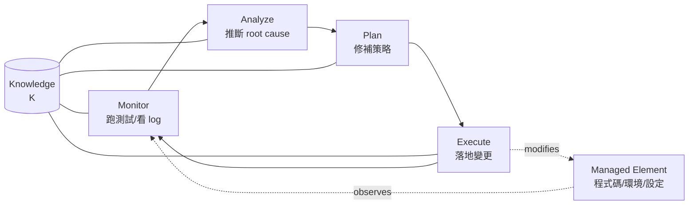
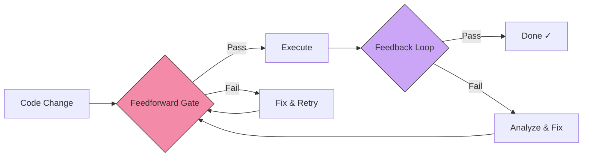
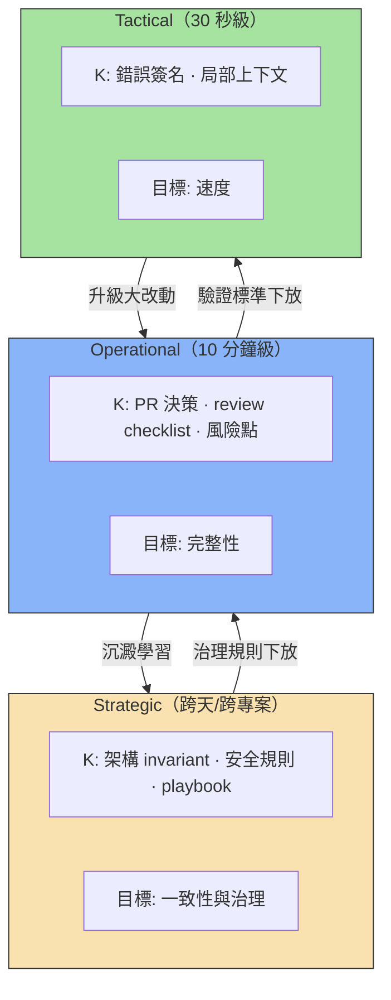
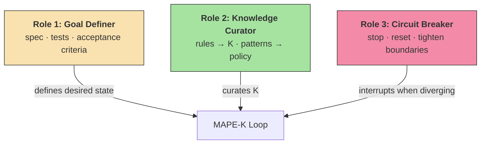
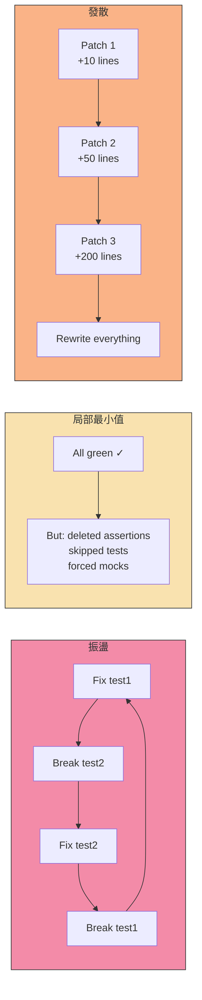
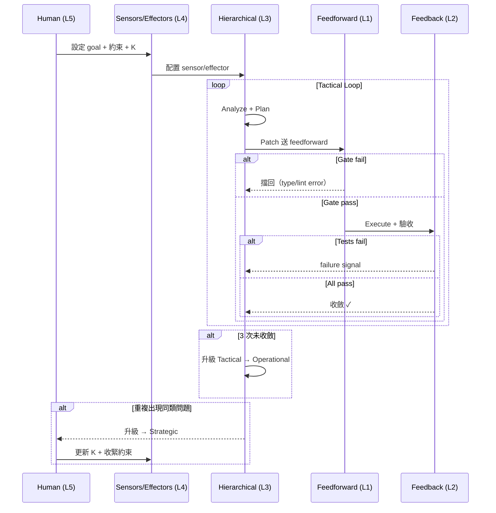
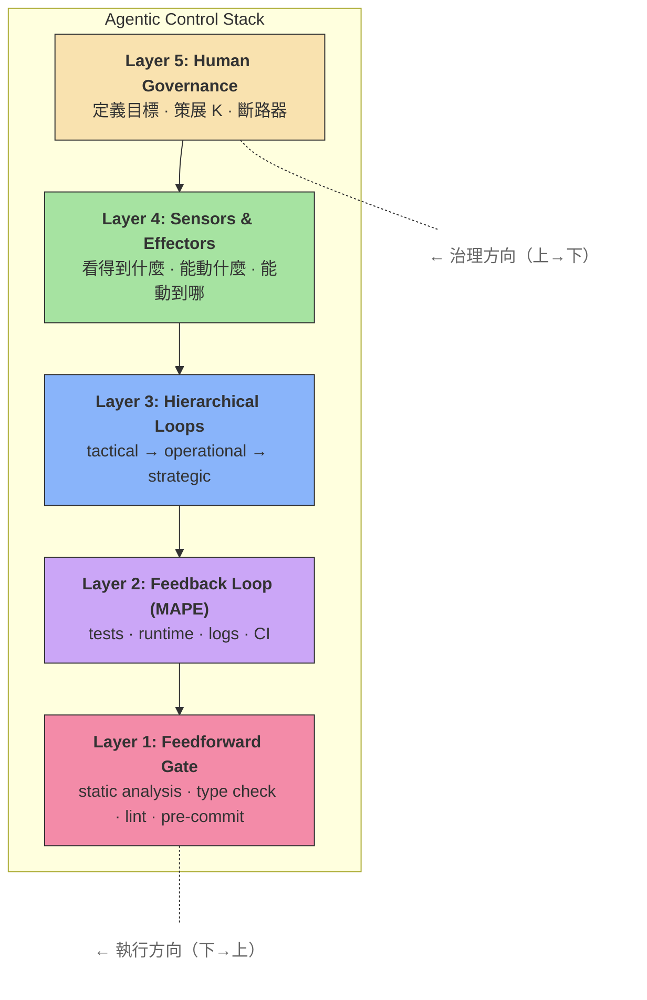
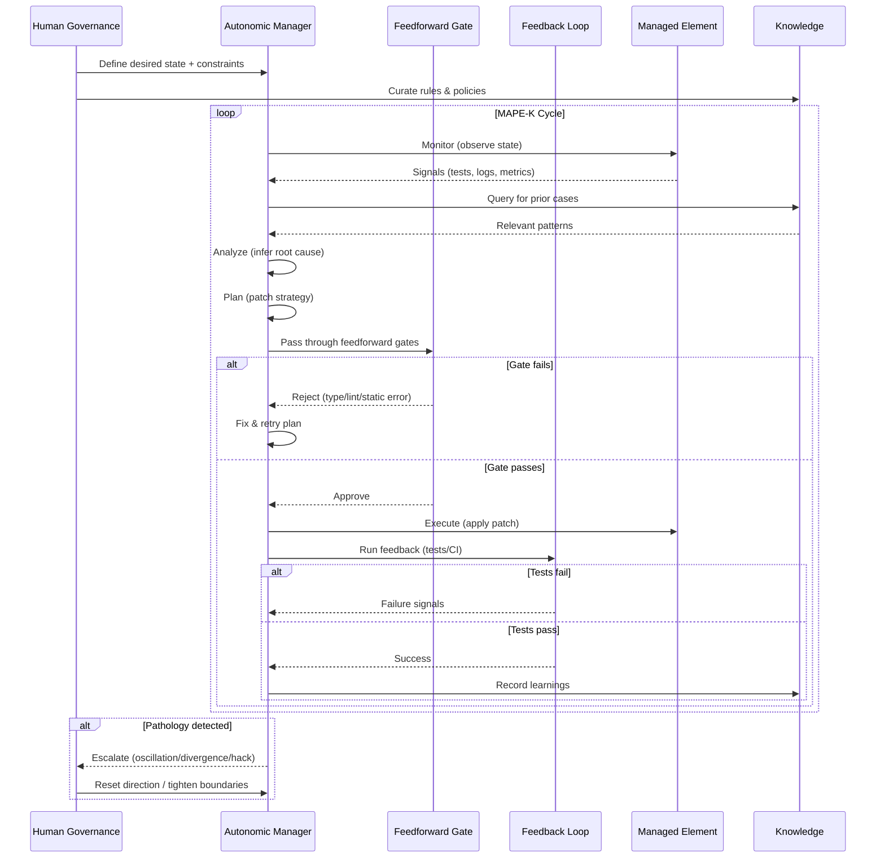

# Agentic Control Stack — 用控制理論解讀 Agentic Coding System

> 設計 agentic system 的功夫不是把 loop 跑起來，而是把 loop「跑歪」的可能性壓到最低。

---

## 第零章：為什麼要用控制理論？

直接說「AI agent 會自己修 bug」，聽起來很酷，但你沒辦法拿這句話去調系統。

控制理論提供一組精確的詞彙——sensor、effector、gain、damping、oscillation——有了這些詞，你才能診斷問題、調校系統，而不是憑感覺說「agent 不太穩」。

舉個例子：「它有時候會出錯」這種描述，你什麼都調不了。但如果你能說出「它在 oscillation，因為 gain 太大、K 太弱」，你就知道要加 diff budget 和記憶。

> **Punchline**：控制理論給你「能調的旋鈕」和「能量化的指標」，讓 agent 從玄學變工程。

---

## 第一章：MAPE-K — 控制迴路的骨架

### 兩個角色

- **Managed element**（被管理的對象）：程式碼、依賴、設定、環境、部署管線、測試、文件
- **Autonomic manager**（管理者）：跑 M-A-P-E 的那個 agent（或 agent + tooling）

Agent 的「自癒」是一個結構化的迴路，持續把實際狀態拉回期望狀態。

### MAPE 四步 + K

| 步驟 | 做什麼 | 輸出 |
|------|--------|------|
| Monitor | 跑測試、看 log、讀 error output；把雜訊整理成可用訊號 | failing tests 清單、stack trace、環境指紋 |
| Analyze | 從觀測推斷 root cause 的候選集；做假設管理（H1/H2/H3），找最便宜的排除實驗 | 最可能的根因 + 最便宜的驗證實驗 |
| Plan | 產生修補策略——包含「改哪裡」和「怎麼證明改對」 | patch 策略 + 驗證計畫 |
| Execute | 落地變更，然後立刻回到 Monitor，看是否更接近目標狀態 | 變更 + 驗證結果 |
| Knowledge (K) | 共享底座。把失敗型態、有效/無效修法、規則與限制沉澱下來 | 讓迴路能收斂而不是亂試 |



簡單講：有 sensor、有 effector、有 oracle 的控制迴路，就是 agent 自癒的全部。

---

## 第二章：前饋 vs 回饋 — 兩道防線

MAPE-K 是迴路骨架，但實際系統要分清兩種防線：前饋（Feedforward）和回饋（Feedback）。

### Layer 1：Feedforward Gate — 在還沒跑壞之前就擋

前饋的意思是在 Plan→Execute 之間，用靜態分析把明顯錯誤擋掉，減少迴路迭代次數。

對應的工具：static analysis / type checking / lint / formatting / schema validation / pre-commit hooks

| | Feedforward | Feedback |
|---|---|---|
| 判斷時機 | Plan→Execute 之間 | Execute 之後 |
| 成本 | 低（靜態、快速） | 高（需要 runtime） |
| 能抓的錯 | 確定性的（型別、格式、規範） | 行為性的（邏輯、整合、效能） |

設計原則：能前移的錯誤全部前移，讓 feedback loop 只處理「跑起來才知道」的問題。

feedforward 做得越好，agent 就越少掉進低級錯誤的迴圈裡。表面上看起來像「天生就很會修」，其實是很多錯根本沒機會發生。

### 量化效能目標參考

設計迴路時，以下指標可以幫助你量化前饋與回饋的效率：

| 指標 | 建議目標 | 說明 |
|------|----------|------|
| Feedforward reject rate | ≥ 60% | feedforward 能擋掉的錯占所有錯誤的比例；越高代表進入 feedback 的低級錯越少 |
| 單輪 feedback latency | < 2 min（tactical）/ < 15 min（operational） | 從 Execute 到 Monitor 回報結果的時間；超過此值考慮拆分驗證範圍 |
| Max retries before escalation | 3 次（tactical）/ 2 次（operational） | 同一層連續未收斂的上限；超過就升級到上一層，避免在同一層空轉 |
| CI cost per feedback round | 追蹤並設 budget | 每輪 feedback 的 CI 資源消耗；feedforward 前移可直接降低此成本 |



### Layer 2：Feedback Loop (MAPE) — Execute 之後驗收

Feedforward 擋得住確定性錯誤，但以下這類問題只有跑起來才會知道：

- 邏輯錯誤：if 條件反了，型別正確但語義錯誤
- 整合問題：A 模組改了 API，B 模組還在用舊介面
- 效能退化：新 code 讓 response time 從 200ms 變 2s
- 環境依賴：本機跑得過、CI 裡 fail

K 在這裡扮演迴路的記憶體。沒有 K，agent 每一輪都從零開始，很容易重踩已知的死路。

Feedback loop 好不好，看的是每一輪能把不確定性降低多少，而不只是最後有沒有修好。

---

## 第三章：分層迴路 — 不是一個大 Loop 處理所有事

MAPE-K 很容易被理解成「一個大 loop 處理所有事」，但實際好用的 agentic coding system 是分層的：每層週期、粒度、oracle、K 都不同。

### 三層架構

| 層級 | 週期 | 粒度 | 目標 | K 的內容 |
|------|------|------|------|----------|
| Tactical（內層） | 30 秒級 | 改一個函式/一個 if → 跑一個小驗證 | 快速收斂 | 錯誤簽名→常見修法、局部上下文 |
| Operational（中層） | 10 分鐘級 | 一個 changeset / PR → 全套 verify | 完整性 | PR 決策、review checklist、風險點 |
| Strategic（外層） | 跨天/跨專案 | 跨任務學習與治理 | 一致性與治理 | 架構 invariant、安全規則、playbook |



這跟「用管 junior 的方式管 AI」是一樣的道理——你設的是不同層級的 checkpoint，不是盯每一步。

內層追速度，中層追完整性，外層追一致性與治理。

---

## 第四章：手眼系統 — Sensors & Effectors

同樣用差不多的 LLM，有的團隊 agent 很穩、有的很鬧——差別通常不在模型，而在手眼配置。

### Sensor（能看到什麼）

好的 sensor 要能提供結構化訊號，直接降低 Analyze 的不確定性，而不是把一坨 raw text 丟給模型看：

- 結構化 test output（哪個 case、哪個 assertion、哪個 fixture）
- 可解析 stack trace → blame 到檔案/函式/行號
- env fingerprint（版本、lockfile hash、feature flags）
- coverage / runtime trace / dependency graph
- 將 review feedback 或規範轉成可機器檢查的 signals

### Effector（能動什麼、被限制成什麼）

好的 effector 要精準、受控，而不是什麼都能動：

- file allowlist / denylist（哪些檔可改）
- diff budget（單次改動上限）
- tool allowlist（format/codemod/migration 能不能用）
- 權限分級（內層只能改 app code，中層才可改依賴/設定，外層才可動 infra）

### 安全控制：手眼系統的防護面

手眼配置不只關乎效能，也直接影響安全性。以下是常見威脅與對應的 sensor/effector 防護：

| 威脅 | 偵測訊號（Sensor） | 控制措施（Effector） | 斷路條件 |
|------|-------------------|---------------------|----------|
| Secret 洩漏 | git diff 中出現 `.env`、API key pattern | file denylist 禁止改動 `.env`、credentials；pre-commit secret scan | 偵測到任何 secret pattern → 立即停止、不 commit |
| Unsafe tool 呼叫 | tool invocation log、shell command audit | tool allowlist（只開放 format/test/lint）；禁止 `rm`、`curl`、`eval` | 未授權 tool 呼叫 → 阻擋並升級到人 |
| 依賴竄改 | lockfile hash 變更偵測、dependency diff | lockfile 唯讀（內層不可改）；新依賴需中層以上核准 | lockfile 被修改 → 升級到 operational review |
| 權限越界 | 改動檔案超出 allowlist 範圍 | file allowlist 硬限制；infra 檔案只有外層可動 | 違反 allowlist → patch 被拒絕 |

### 產業觀察

大模型能力在收斂，差距在縮小。真正的系統差異在「看得見什麼、動得了什麼、動得多精準」。模型是大腦，sensor 和 effector 是眼和手；手眼不行，大腦再強也是在黑箱裡亂摸。

---

## 第五章：人的治理層 — Human Governance

MAPE-K 的理想是 self-management、減少人介入，但在 coding agent 的現階段，人是「定義目標、治理迴路」的核心角色。

### 三個角色



| 角色 | 做什麼 | 為什麼不可取代 |
|------|--------|----------------|
| Desired State 的定義者 | 寫 spec、寫測試、定義 acceptance criteria | oracle 不夠強的話，迴路必定收斂到錯的地方 |
| Knowledge 的策展人 | 決定哪些規則進 K，把一次性經驗變成可重用 policy | 讓 agent 不用每次從零開始 |
| Loop 的斷路器 | 振盪、發散、hack 時介入：停、重設目標、收緊邊界 | 包含把問題從內層升級到外層處理 |

開發者的角色正在從「寫 code 的人」轉變成「設計與調校控制迴路的人」。你不是在手動修程式，而是在調 sensor、effector、oracle 和 knowledge，讓 loop 自己收斂。

---

## 第六章：迴路病理學 — 三種經典失敗模式

學生最常問的就是：「你講的迴路聽起來都很好，那什麼時候它會壞掉？」



### 1. Oscillation（振盪）

症狀：修好 test1 壞 test2；再修 test2 又壞 test1；commit history 出現 revert-revert-revert。

根因：

- K 太弱：不記得「這條路剛試過」
- Plan 的 gain 太大：每次改動太猛、太廣
- Monitor 訊號不穩：flaky tests 或觀測不一致

治法：

| 旋鈕 | 做法 |
|------|------|
| 加阻尼（damping） | 限制單次 patch 範圍（diff budget / file allowlist） |
| 加記憶（K） | 把「嘗試過的 patch → 造成的失敗型態」寫成 case，下一輪直接禁止重踩 |
| 穩定觀測（Monitor） | 先做 flaky 判定、重跑一致性、固定 seed / env fingerprint |

### 2. Local Minimum（局部最小值）

症狀：綠了，但靠 hack 綠（刪 assertion、硬塞 mock、跳過測試）。

根因：Desired state 定義太弱（oracle 太弱），Monitor 回報「達標」其實是錯的達標。

治法：

| 旋鈕 | 做法 |
|------|------|
| 強化 oracle | 除了 tests pass，再加「不得刪 assertion」「coverage 不得下降」「關鍵 invariant 必須被測到」 |
| 把 review 也當 sensor | 將 code review checklist 形式化成可檢查規則 |
| 測試設計當人類責任 | acceptance criteria 要能把 hack 擋掉，不然 loop 必然收斂到 hack |

### 3. Divergence（發散）

症狀：越修 diff 越大，最後和原本系統行為無關。

根因：Plan 階段缺少「變更邊界」，effector 動作空間太大。

治法：

| 旋鈕 | 做法 |
|------|------|
| 硬邊界 | 可改檔案白名單、禁止改 infra/lockfile、禁止跨模組大重構 |
| 節流 | 大改動要升級到更外層迴路，不能在內層快速迴圈放飛 |
| 斷路器 | diff 超過 budget / 連續 N 次未改善，強制停下交給人 |

### 診斷摘要表

| 失敗模式 | 症狀特徵 | 核心根因 | 首要旋鈕 |
|----------|----------|----------|----------|
| Oscillation | revert-revert-revert | gain 太大 + K 太弱 | diff budget + 記憶 |
| Local minimum | hack 綠（刪 assertion） | oracle 太弱 | 強化 invariant 檢查 |
| Divergence | diff 爆炸 | 邊界太寬 | file allowlist + 斷路器 |

有迴路不代表會收斂。收斂要靠阻尼、oracle、以及邊界。

---

## 第七章：端到端貫穿案例 — 修復 API 500 Error

一個貫穿五層的具體案例，把抽象框架對應到真實工作流。

場景：線上服務的 `/api/users/:id` endpoint 出現間歇性 500 error。你的 coding agent 被指派修復。

### Step 1 — Human Governance (L5)：人先定義規則

| 人的角色 | 具體動作 |
|----------|----------|
| Goal Definer | 定義 acceptance criteria：「500 error rate 從 2% 降到 < 0.1%，且不引入新的 regression」 |
| Knowledge Curator | 把已知 context 餵進 K：「這個 endpoint 用了 ORM eager loading，上次也是 null reference 造成 500」 |
| Circuit Breaker | 設定邊界：「只能改 `src/api/users/` 下的檔案，不能動 database schema」 |

### Step 2 — Sensors & Effectors (L4)：配好手眼

Sensors：

- structured test output：哪個 test case、哪個 assertion、哪個 fixture
- production error log：structured JSON，含 request ID、user ID、stack trace
- coverage report：修改前 85%，不得低於此值

Effectors：

- file allowlist：`src/api/users/*.ts`, `test/api/users/*.test.ts`
- diff budget：單次 patch ≤ 50 行
- tool allowlist：可用 format、可跑 test，不可用 codemod

### Step 3 — Hierarchical Loops (L3)：分層處理

Tactical（30 秒級）：

```
Hypothesis: user.profile 可能是 null → 加 null check
Patch: if (!user.profile) return res.status(404)
Verify: test_get_user_profile → PASS / test_get_user_admin → FAIL（新 regression）
```

Operational（10 分鐘級）— Tactical 連續 3 次未完全收斂，升級：

```
Agent 重新 Analyze：不只看單一函式，看整個 handler chain
發現：問題不在 null check，而是 middleware 的 error handling 不一致
Plan：統一 error handler pattern（影響 3 個檔案）
Verify：full test suite + lint + type check
```

Strategic（跨天）— 如果第三次在同一模組出類似問題：

```
人介入：這個模組需要加 integration test coverage policy
K 更新：「所有 API handler 必須有 null safety 的 integration test」
```

### Step 4 — Feedforward (L1)：在 Execute 前擋低級錯

```
1. TypeScript 型別檢查 → PASS
2. ESLint rules → WARN: unused import（自動修復）
3. Schema validation → PASS
4. Pre-commit hook → PASS
→ 全部通過，允許 Execute
```

### Step 5 — Feedback (L2)：Execute 之後驗收

| MAPE 步驟 | 行為 | 結果 |
|-----------|------|------|
| Monitor | 跑 full test suite (32 tests) | 31 pass, 1 fail |
| Analyze | 失敗的是 `test_concurrent_requests`，stack trace 指向 race condition | root cause: null check 和 concurrent access 衝突 |
| Plan | 改用 optional chaining + 加一個 lock；補 concurrent test case | +15 行改動 |
| Execute | Apply patch → 回到 Monitor | 32/32 pass + coverage 86% (> 85%) |

所有 oracle 達標 → loop 終止。

### 故障注入：如果少了某一層會怎樣？

用這個案例來反向驗證每層的必要性——拿掉某個控制，對應的病理就會出現：

| 拿掉的控制 | 觸發的病理 | 具體會發生什麼 | 預期的緩解措施 |
|-----------|-----------|---------------|---------------|
| 拿掉 diff budget | Oscillation | 每次 patch 改太多行，修 A 壞 B、修 B 壞 C，commit history 出現 revert 迴圈 | 限制單次 patch ≤ 50 行 + 把嘗試過的 patch 寫入 K |
| 拿掉 coverage check | Local minimum | Agent 刪掉 `test_concurrent_requests` 的 assertion 讓測試「通過」，實際 bug 沒修 | coverage 不得低於 85% + 禁止刪除既有 assertion |
| 拿掉 file allowlist | Divergence | Agent 開始改 database schema、動 middleware 設定，diff 越滾越大，最終偏離原始目標 | 限制只能改 `src/api/users/` + diff 超過 budget 觸發斷路器 |
| 拿掉 Knowledge (K) | Oscillation + 效率低落 | Agent 不記得上一輪試過什麼，重複嘗試已知會失敗的 patch | 每輪結果寫入 K，下一輪查詢前案再決定方向 |
| 拿掉人的治理 (L5) | 全部三種 | 沒有 acceptance criteria → local minimum；沒有邊界 → divergence；沒有斷路器 → oscillation | 人先定義 goal + constraint，才啟動 agent |

### 完整流程圖



### 教學提示

1. 先展示場景，讓學生猜「你會怎麼讓 agent 修這個 bug」
2. 從 Layer 5 開始往下走，每層問學生：「如果少了這一層，會發生什麼事？」
3. 走到 pathology：讓學生指出如果沒有 diff budget（oscillation）、沒有 coverage check（local minimum）、沒有 file allowlist（divergence），這個案例會怎麼壞

> **Punchline**：五層不是各自獨立——少任何一層，整個迴路就會在對應的失敗模式上栽跟頭。

---

## 五層總覽圖



上層治理下層（規則與約束向下傳遞），但管線執行順序是從底層（Feedforward）往上走。

> **Punchline**：治理由上而下，執行由下而上——五層堆疊的方向性就是系統穩定的關鍵。

---

## 全系統 Sequence Diagram



> **Punchline**：一張圖看完整個系統——Human 定方向、Agent 跑迴路、Feedforward 擋低級錯、Feedback 驗行為、Knowledge 防重蹈覆轍。

---

## 課後作業

### 設計 Checklist

如果你要從零設計一個 agentic coding loop，至少回答這些問題：

1. Oracle：我的 oracle 是什麼？除了 tests pass 還有哪些 invariants？
2. Feedforward：我的 feedforward gates 有哪些？能不能在 Execute 前擋掉 60% 的錯？
3. Pathology detection：我怎麼偵測振盪 / 局部最小值 / 發散？各自的 circuit breaker 條件是什麼？
4. Sensors：我有哪些 sensor 能提供結構化訊號？哪些只是 raw text？
5. Effectors：我的 effector 動作空間有多大？有沒有 diff/file budget？
6. Hierarchy：迴路分幾層？每層的 K 是什麼？誰負責維護？
7. Human role：人在什麼地方介入？介入的門檻與成本是什麼？

---

### 討論題

#### Q1: Feedforward vs Feedback boundary

你的團隊目前有哪些檢查是在 feedback 層做的，但其實可以前移到 feedforward？舉出至少兩個例子，並估算前移後能省掉多少 CI 時間。

#### Q2: Diagnose a pathology

場景：一個 coding agent 在修 API endpoint 的 bug，commit history 如下：

1. Fix null check in handler
2. Revert: null check breaks other test
3. Add null check with different approach
4. Revert: still breaks
5. Disable flaky test
6. Fix passes

這裡出現了哪些病理？分別是什麼根因？你會怎麼調系統旋鈕來防止？

#### Q3: Sensor quality

比較以下兩種 test failure output：

- **(A)** `FAIL: 3 tests failed`
- **(B)** `FAIL: test_user_login (test_auth.py:42) — AssertionError: expected status 200, got 401. Fixture: mock_db with user role=admin`

哪個讓 Analyze 步驟更容易？為什麼？如果你只能改一件事來提升 sensor 品質，你會改什麼？

#### Q4: Hierarchical loop design

為以下升級條件各設計一個具體觸發規則：

- Tactical → Operational：什麼時候小修補應該升級為 PR 級 review？
- Operational → Strategic：什麼時候 PR 級問題應該觸發架構層級的討論？

#### Q5: Human governance boundary

「人應該寫所有測試」vs「讓 agent 也寫測試」——用 oracle 的角度分析這兩種策略的 trade-off。什麼情況下讓 agent 寫測試是安全的？什麼情況下不是？

#### Q6: Effector budget

如果你要為 coding agent 設定 diff budget（單次改動行數上限），你會設多少？為什麼？

> 提示：考慮 review 成本、回滾風險、測試覆蓋率的信心。

---

### 課堂活動：Build Your Own Control Stack

目標：3-4 人一組，為一個真實的 coding task 設計完整的 control stack。

步驟：

1. 選一個真實場景（例：修復 flaky test、實作新 API endpoint、遷移一個依賴）
2. 畫出你的 5 層 stack，每層至少寫出具體工具/檢查
3. 預測：最可能遇到哪種病理？防護機制是什麼？
4. 各組互相 review：找出對方 stack 的弱點

評分維度：

- 各層是否具體可操作（不是空泛的「跑測試」）
- 病理預測是否合理
- 人的角色是否明確定義

> **Punchline**：學完理論之後，能不能自己從零設計一個 control stack，就是檢驗你是否真正理解的唯一標準。
